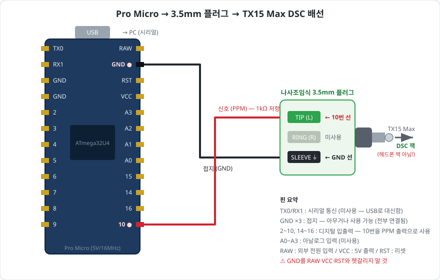

# BuddyBox

PC에서 RadioMaster **TX15 Max**의 트레이너(Student/Teacher) 기능을 이용해
ELRS → Betaflight 드론을 관제하는 프로젝트.

```
Python (PC) ──USB 시리얼──▶ Pro Micro ──PPM──▶ TX15 Max DSC 포트
                                                  │ EdgeTX Trainer (Master/Jack)
                                                  ▼
                                        내장 ELRS ──▶ 수신기 ──▶ Betaflight FC
```

PC는 스틱 4채널(Roll/Pitch/Yaw/Throttle)만 제어하고, **ARM·모드 스위치는 조종기에 유지**한다.

> **진행 상황**: Phase 4까지 완료 (PC→조종기 트레이너 체인 실물 검증, 트레이너 스위치 동작 확인).
> 다음 단계는 Phase 5 Betaflight 검증 (props off). 전체 로드맵: [docs/plan.md](docs/plan.md)

## 안전 계층

1. **트레이너 스위치(모멘터리)** — 놓는 순간 조종기 스틱으로 복귀
2. **Pro Micro 타임아웃** — 시리얼 프레임 500ms 단절 시 PPM 정지 → EdgeTX가 스틱 복귀
3. **Betaflight 페일세이프** — ELRS 링크 상실 시 Drop/GPS Rescue

## 구성

| 경로 | 내용 |
|---|---|
| [firmware/promicro_ppm/](firmware/promicro_ppm/) | Pro Micro 펌웨어 (시리얼 → PPM) |
| [firmware/clock_check/](firmware/clock_check/) | 보드 클럭(16/8MHz) 판별 스케치 |
| [python/buddybox/](python/buddybox/) | PC 제어 라이브러리 (실물 시리얼 + SITL UDP 백엔드, SafetyLimiter 안전 필터) |
| [python/buddybox/vision/](python/buddybox/vision/) | Walksnail VRX Pro UVC 캡처 + RF-DETR ONNX 사람 검출 + 타깃 추적 |
| [python/buddybox/follow/](python/buddybox/follow/) | 사람 추적 → 스틱 PID 컨트롤러, 모드 감독(STANDBY/HOVER/FOLLOW), 파이프라인 |
| [python/examples/](python/examples/) | 수동 조종 GUI, 채널 스윕 테스트, 자동 제어 루프 뼈대, **사람 추적 UI(person_follow.py)** |
| [python/tools/](python/tools/) | 세션 리포트(`session_report.py`)·오프라인 PID 리플레이(`session_replay.py`) 분석 도구 |
| [python/tests/](python/tests/) | 단위 테스트 (프로토콜·안전 필터·시뮬레이션·PID·트래커·컨트롤러·상태기계·세션 도구) — CI에서 자동 실행 |
| [tools/person_follow.bat](tools/person_follow.bat) | 사람 추적 UI 실행 메뉴 (VRX/웹캠/파일 × sim/Pro Micro/SITL) |
| [docs/wiring.md](docs/wiring.md) | Pro Micro ↔ DSC 포트 배선 (+ 플러그 라벨 오표기 실전 이슈) |
| [docs/radio-setup.md](docs/radio-setup.md) | EdgeTX 트레이너 설정 + 안전 체크리스트 |
| [docs/betaflight-verify.md](docs/betaflight-verify.md) | Phase 5 Betaflight 검증 절차 (props off) |
| [docs/sitl-gazebo.md](docs/sitl-gazebo.md) | Betaflight SITL + Gazebo 시뮬레이션 (sim-to-real) |
| [docs/person-follow.md](docs/person-follow.md) | Meteor75 Pro 2 사람 추적·호버링 (VRX Pro 캡처 노하우, 제어 로직, 운용 절차) |
| [docs/plan.md](docs/plan.md) | 프로젝트 계획 & 진행 상황 |
| [docs/qna.md](docs/qna.md) | 질문 & 답변 로그 |

## 배선 다이어그램



| 핀 | 뜻 | 이 프로젝트에서 |
|---|---|---|
| **10** | 디지털 입출력 | **PPM 신호 출력 → 플러그 TIP(L)** |
| **GND** (3개) | 접지 (전부 내부 연결) | **아무거나 → 플러그 접지 단자** (아래 주의 참조) |
| TX0 / RX1 | 하드웨어 시리얼 | 미사용 (PC 통신은 USB로) |
| 2~9, 14~16 | 디지털 입출력 | 미사용 |
| A0~A3 | 아날로그 입력 | 미사용 |
| RAW / VCC / RST | 외부 전원 입력 / 5V 출력 / 리셋 | 미사용 — **GND와 헷갈리지 말 것!** |

> ⚠️ **나사조임식 플러그 주의**: 단자 라벨이 실제 접점과 다를 수 있다.
> 본 프로젝트의 플러그는 ⏚(접지) 라벨 단자가 내부 미연결이라 **GND를 R 단자에
> 연결해야** 동작했다. 신호가 끊기다 이어지길 반복하거나 금속을 만질 때만 안정되면
> 접지 단선 증상이니 [docs/wiring.md](docs/wiring.md)의 실전 이슈 항목을 볼 것.

## 시작하기

1. **배선** — [docs/wiring.md](docs/wiring.md) 대로 D10→Tip(L), GND→접지 단자 연결 (라벨 오표기 주의)
2. **펌웨어** — Arduino IDE에서 보드 클럭 확인 후 `promicro_ppm.ino` 업로드
3. **조종기** — [docs/radio-setup.md](docs/radio-setup.md) 대로 Trainer Master/Jack 설정
4. **PC**
   ```
   cd python
   pip install -r requirements.txt
   cd examples
   python channel_sweep.py        # 조종기 Trainer 화면에서 신호 확인
   python manual_control.py       # 슬라이더/키보드 수동 조종
   ```
5. **검증** — 프롭 제거 후 [docs/betaflight-verify.md](docs/betaflight-verify.md) 절차대로 Receiver 탭 확인 + 페일세이프 3종 테스트
6. **사람 추적 (비전)** — `pip install -r requirements-vision.txt` 후 바탕화면 `BuddyBox Person Follow` 바로가기 또는
   `tools\person_follow.bat` ([docs/person-follow.md](docs/person-follow.md)). 비행마다 세션이 자동 기록되고
   `python tools/session_report.py` 로 분석한다.

## 시리얼 프로토콜 (PC → Pro Micro, 115200 baud)

19바이트 고정 프레임, 50Hz:

| 바이트 | 내용 |
|---|---|
| 0–1 | 헤더 `0xA5 0x5A` |
| 2–17 | 8채널 × uint16 LE, 펄스폭 µs (988–2012) |
| 18 | 2–17 바이트 XOR 체크섬 |

채널 순서(AETR): CH1 Roll, CH2 Pitch, CH3 Throttle, CH4 Yaw, CH5–8 예비(중립).
